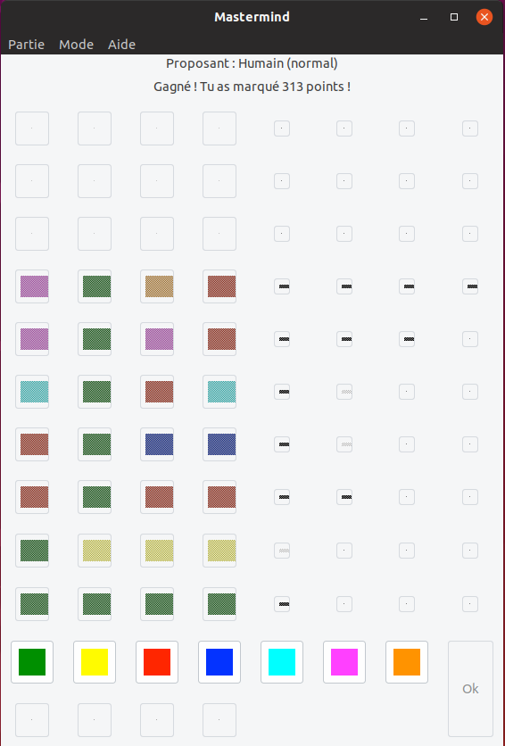
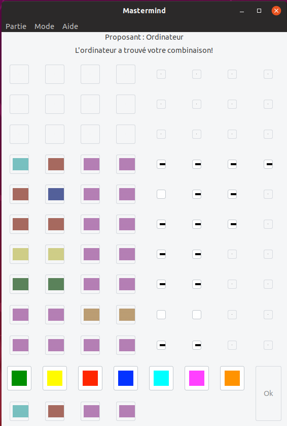

# Mastermind

<div align="center">
    
    
</div>

Mastermind is a classic puzzle game. This repo contains the source code for a version of Mastermind built with GTK+ 2.0 for Linux distributions and macOS. Below, you'll find instructions on how to set up the necessary environment and launch the game.

## Prerequisites

Before running the application, ensure that you have GTK+ 2.0 installed on your system. Here are the steps to install GTK+ 2.0 depending on your Linux distribution or macOS.

### Debian-based Systems (Ubuntu, etc.)

Open a terminal window and run the following commands:

1. Update the list of available packages:
    ```bash
    sudo apt update
    ```
2. Install the GTK 2.0 development libraries:
    ```bash
    sudo apt install libgtk2.0-dev
    ```

### Fedora, CentOS, or RHEL

Open a terminal window and run the following commands:

1. Install the GTK 2.0 development libraries:
    ```bash
    sudo dnf install gtk2-devel
    ```

    If you're using `yum`, use this command instead:
    ```bash
    sudo yum install gtk2-devel
    ```

### Arch Linux

Open a terminal window and run the following command to install the GTK 2.0 development libraries:

```bash
sudo pacman -S gtk2
```

### macOS

For macOS, the GTK+ 2.0 library can be installed via Homebrew. If Homebrew isn't already installed, use the following command to install it:

```bash
/bin/bash -c "$(curl -fsSL https://raw.githubusercontent.com/Homebrew/install/master/install.sh)"
```

After Homebrew is installed, install GTK+ 2.0 with:

```bash
brew install gtk+
```

## Compilation

After installing the necessary libraries, compile the program by running:

```bash
make
```

This will create the executable for the game.

## Launch the Game

Navigate to the source directory and execute the `mastermind` binary:

```bash
cd source
./mastermind
```

Enjoy the game!

_Note_: If you're using an IDE, remember to restart it after the GTK+ 2.0 installation so it can pick up the newly installed libraries.

## Authors
- Marco Naa
- Jordi Hoorelbeke